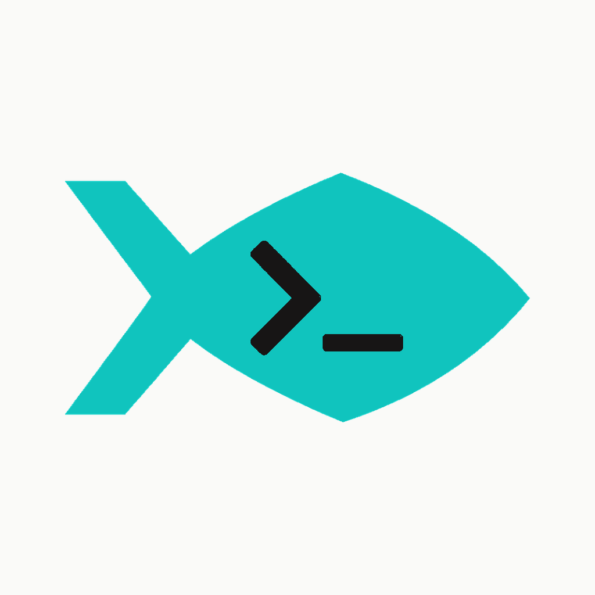

# Aquarium

<picture><source media="(prefers-color-scheme: dark)" srcset="plugins/aquarium/assets/logo-black.png"></picture>

By [Root Kernel](https://home.rootkernel.xyz)

Aquarium is a Codex plugin marketplace for evidence-gated roadmap delivery, release-candidate QA, optional Podway v2 execution memory, and safe development-tool setup across Aquarium projects.

Website: [home.rootkernel.xyz](https://home.rootkernel.xyz) · Support: [cs@rootkernel.xyz](mailto:cs@rootkernel.xyz)

## Skills

| Skill | Purpose | Invocation |
|---|---|---|
| `epic-handler` | Orchestrate an epic through sequential task goals and a convergent epic-wide audit. | Explicit: `$aquarium:epic-handler` with a roadmap path and one epic ID |
| `epic-validator` | Cold-validate a completed epic and converge confirmed gaps through remediation goals. | Explicit: `$aquarium:epic-validator` with a roadmap path and one epic ID |
| `task-handler` | Strengthen the procedure around one task goal through focused phase skills and verified transitions. | Explicit: `$aquarium:task-handler` with a roadmap path and one task ID |
| `task-commit` | Reconcile roadmap ownership and lifecycle state, then create one authorized isolated commit. | Automatic for commit requests, or explicit: `$aquarium:task-commit` |
| `release-qa` | Exercise every change since the previous stable release through isolated user scenarios, before or after target-version metadata is committed, without rerunning existing tests or proposing fixes. | Explicit: `$aquarium:release-qa` with an intended version or version confirmation |
| `dev-setup` | Diagnose and configure selected development tools, automatically compare selected paired skills with their latest supported releases, and propose reference-based AGENTS.md guidance behind separate approvals. | Explicit: `$aquarium:dev-setup` |
| `independent-review` | Run a supervised read-only requirements and code review with a fresh Codex, then adjudicate its findings. | Explicit: `$aquarium:independent-review` with one epic or task ID |
| `deslop` | Remove task-introduced AI code slop without changing behavior or unrelated work. | Automatic when relevant, or explicit: `$aquarium:deslop` |

Invoking `release-qa` authorizes read-only queries to the repository's configured Git remote and hosting Release metadata without another network prompt. Configured clients may use existing ambient authentication for private repositories, but the skill never reads, reports, persists, refreshes, or changes credentials, starts authentication, uploads source, or permits network access from QA scenarios.

### Task-handler phases

`task-handler` loads these leaf skills in order. Their implicit invocation is disabled; invoke one directly only to resume that exact phase with its required task context.

| Phase skill | Responsibility |
|---|---|
| `task-plan` | Read authority and produce an approved decision-complete plan without mutation. |
| `task-implement` | Implement only the approved task scope. |
| `task-verify` | Map requirements to current agent-run or user-run verification evidence. |
| `task-refine` | Run deslop, establish the staged baseline, and perform bounded optimization. |
| `task-document` | Update durable documentation and move the roadmap task to its defined review state. |
| `task-review` | Run Mulgae against one exact complete task target and resolve valid findings. |
| `task-close` | Obtain final user approval, apply the user-selected terminal status, and hand an authorized commit to `task-commit`. |

The three goal-centered workflows have distinct entry points. `epic-handler` connects multiple task goals into one epic outcome while leaving each task's internal procedure flexible. `task-handler` strengthens the procedure around one task goal with explicit phases and user-visible transition gates, moving it to a defined `In Progress` state after plan approval when available. `epic-validator` starts from a committed completed epic, independently audits it, and resolves confirmed gaps through sequential remediation goals. None invokes another. Their actual commits share `task-commit`. Direct commit requests require explicit task relationship and lifecycle or checkpoint confirmation; handler commits carry the owner's approved lifecycle or record decision in a bounded handoff. Commit, upstream publication, and live validation remain separate states.

### Roadmap commit guard

Aquarium includes a local `PreToolUse` hook that detects direct shell `git commit` commands in repositories with tracked roadmap lifecycle files. Such commits must pass through `task-commit`; repositories without a detected roadmap are unaffected. The hook uses only the command, working directory, tracked roadmap paths, and local lifecycle text, and neither writes project state nor transmits data.

After installing or upgrading Aquarium, open `/hooks` and explicitly trust the plugin hook. Skill matching is best-effort, while the trusted hook supplies the deterministic direct-command guard. It is not complete enforcement: commits created indirectly by another tool may not pass through the shell boundary.

### Optional Podway integration

[Podway](https://github.com/irootkernel/podway) v0.2.5 through v0.2.x can provide durable Procedure v2 state for Aquarium workflows on native Apple Silicon macOS. `dev-setup` can separately install the matching optional `use-podway` user skill and three managed Procedures. The binary, skill, configuration, Procedures, daemon, and any existing session describe availability and readiness; invoking `task-handler`, `epic-handler`, or `epic-validator` selects Podway by default. A new session starts as prepared, then the owning handler re-observes it and uses `begin` to create attempt 1 and the initial goal.

The user may explicitly opt the current task, epic, or validation out before its first managed-session mutation; that choice never carries into later work. Otherwise the handler checks readiness and discloses Podway operations in its plan or execution envelope. Degraded readiness routes to `dev-setup` repair or workflow opt-out. A healthy conflicting session is a lifecycle conflict instead: resume it through its matching handler, leave it untouched through opt-out, or explicitly invoke `use-podway` to cancel or discard it. Handlers alone own and advance Aquarium workflows; standalone `use-podway` lifecycle requests do not adopt roadmap ownership.

During an active session, a stop request requires an explicit disposition: leave the session active for later resumption, cancel the task while preserving history, or reset the session and delete its history. Cancellation is not a pause and cannot reactivate; reset requires a dry run and separate confirmation of the irreversible history loss. Continuing the remaining Aquarium work without Podway starts a new explicitly opted-out workflow rather than changing the active workflow in place.

At a successful terminal boundary, Aquarium records `handed_off` only when an exact authoritative external result such as the committed roadmap task is verified. An approved internal epic boundary with no external handoff may record `not_required` only when the same handler retains ownership and must replace the session. Otherwise Aquarium leaves the terminal session undisposed. It never chooses force reset or force replacement automatically.

## Install

Add the Git marketplace and install the plugin:

```bash
codex plugin marketplace add irootkernel/aquarium --ref main
codex plugin add aquarium@aquarium
```

Restart Codex after installation or upgrade so the active session reloads the installed skill snapshot, then open `/hooks` and trust Aquarium's roadmap commit guard.

### Migrating from Root Kernel

Aquarium v0.1.4 replaces the previous marketplace, plugin invocation prefix, inspection schema, and managed Podway Procedure IDs without compatibility aliases. Before upgrading, finish or explicitly dispose of any active `root-kernel-*` Podway session; Aquarium does not convert or delete its runtime history. Then remove the previous installation, add the renamed marketplace, install Aquarium, and restart Codex:

```bash
codex plugin remove root-kernel
codex plugin marketplace remove root-kernel-dev-skills
codex plugin marketplace add irootkernel/aquarium --ref main
codex plugin add aquarium@aquarium
```

Repositories configured for Podway must remove the tracked `.podway/procedures/root-kernel-{task,goal,validation}-v2.yaml` files and install the corresponding `aquarium-*` Procedures through a separately approved `$aquarium:dev-setup` migration. Do not replace managed Procedures while an old session is active.

## Development-tool ecosystem

When `dev-setup` selects Sanho, Mulgae, Gaori, or Podway for setup or diagnosis, it automatically reads that tool's official GitHub release metadata and four public skill files to compare the latest supported stable skill with the exact `~/.agents/skills/use-*` target. Matching skills require no prompt; missing or different skills are installed or replaced only after an exact proposal and separate approval. Unselected tools and other network operations are not covered by this comparison authorization.

- [Sanho](https://github.com/irootkernel/sanho) synchronizes project documentation with its canonical documentation repository. Aquarium supports stable v0.2.7 through v0.2.x, including read-only push preview and canonical history inspection, and can separately install the matching optional `use-sanho` user skill for Git-boundary guidance.
- [Mulgae](https://github.com/irootkernel/mulgae) performs advisory multi-provider code review against an explicitly selected capture. Aquarium supports stable v0.1.16 through v0.1.x, including Config v3, Doctor v2 offline readiness, prose-first structured finding extraction, and explicit Codex provider profiles, can install the matching optional `use-mulgae` user skill, and can separately configure a repository-bound local MCP server.
- [Gaori](https://github.com/irootkernel/gaori) runs existing checks while preserving raw logs and producing bounded evidence. Aquarium supports stable v0.1.13 through v0.1.x, including read-only parser and completed-run discovery, can install the matching optional `use-gaori` user skill, and can separately configure a repository-bound local MCP server.
- [Lora](https://github.com/tmdgusya/lora) provides Lore skills for recording and querying decision context in Git trailers.
- [Podway](https://github.com/irootkernel/podway) guards the handlers' default local Procedure v2 execution state, rework, recorded evidence, and goal assessment without running commands or judging evidence truth. Aquarium supports stable v0.2.5 through v0.2.x and can separately install the matching optional `use-podway` user skill.

## Validate

Run the repository validation (the lint step requires Ruff):

```bash
python3 -m unittest tests/test_inspect_tools.py tests/test_task_commit_gate.py
ruby tests/validate.rb
ruff check plugins/aquarium/skills/dev-setup/scripts/inspect_tools.py plugins/aquarium/hooks/task_commit_gate.py tests/test_inspect_tools.py tests/test_task_commit_gate.py
git diff --check
```

The validation checks plugin metadata, skill frontmatter and UI metadata, the roadmap commit hook, setup safety invariants, third-party attribution, distribution files, managed Podway procedures and their rework routes, cross-file pinned wording, relative Markdown links, and the no-hard-wrap documentation convention.

## Documentation style

Do not hard-wrap prose in project documentation. Keep each prose paragraph on one source line; use line breaks only for structural Markdown, code, tables, lists, or other syntax where the break is meaningful.

## License

This repository is licensed under the [MIT License](LICENSE). The bundled `deslop` skill is derived from Cursor Team Kit and retains its separate upstream MIT notice.
