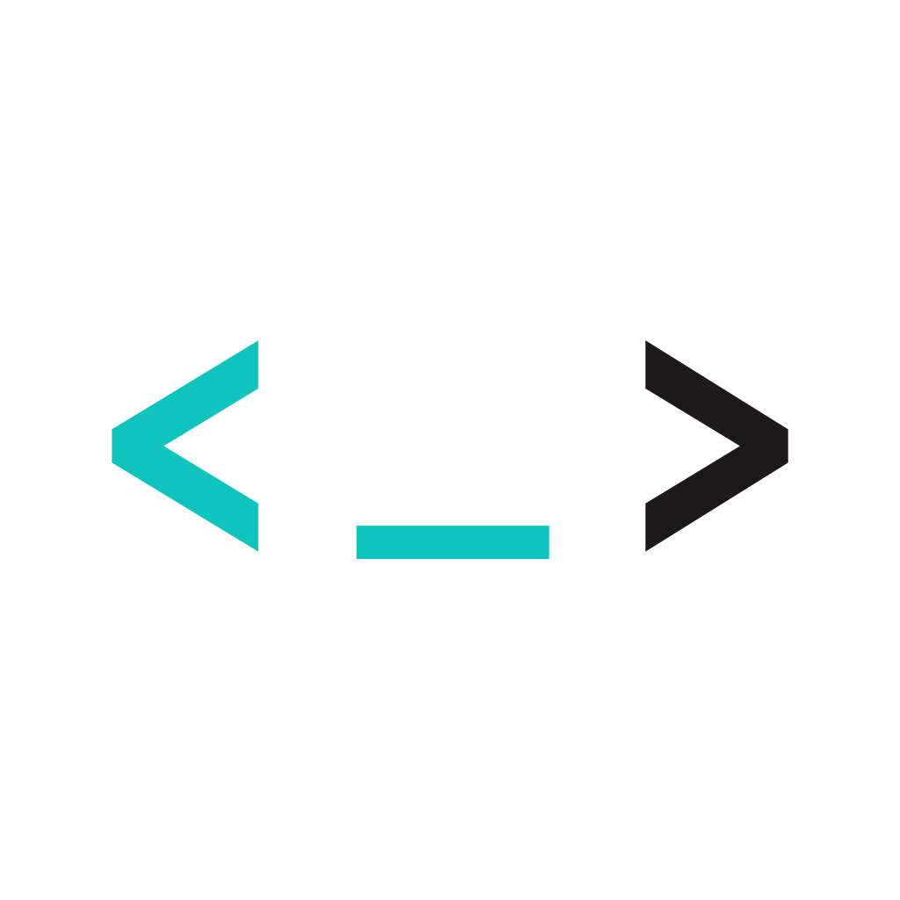

# Root Kernel Dev Skills

<picture><source media="(prefers-color-scheme: dark)" srcset="plugins/root-kernel/assets/logo-black.png"></picture>

Root Kernel Dev Skills is a Codex plugin marketplace for evidence-gated roadmap delivery and safe development-tool setup across Root Kernel projects.

Website: [home.rootkernel.xyz](https://home.rootkernel.xyz) · Support: [cs@rootkernel.xyz](mailto:cs@rootkernel.xyz)

## Skills

| Skill | Purpose | Invocation |
|---|---|---|
| `epic-handler` | Orchestrate an epic through sequential task goals and a convergent epic-wide audit. | Explicit: `$root-kernel:epic-handler` with a roadmap path and one epic ID |
| `epic-validator` | Cold-validate a completed epic and converge confirmed gaps through remediation goals. | Explicit: `$root-kernel:epic-validator` with a roadmap path and one epic ID |
| `task-handler` | Strengthen the procedure around one task goal through focused phase skills and verified transitions. | Explicit: `$root-kernel:task-handler` with a roadmap path and one task ID |
| `dev-setup` | Diagnose and configure selected development tools, and propose reference-based AGENTS.md guidance behind separate approvals. | Explicit: `$root-kernel:dev-setup` |
| `independent-review` | Run a supervised read-only requirements and code review with a fresh Codex, then adjudicate its findings. | Explicit: `$root-kernel:independent-review` with one EPIC or TASK ID |
| `deslop` | Remove task-introduced AI code slop without changing behavior or unrelated work. | Automatic when relevant, or explicit: `$root-kernel:deslop` |

### Task-handler phases

`task-handler` loads these leaf skills in order. Their implicit invocation is disabled; invoke one directly only to resume that exact phase with its required task context.

| Phase skill | Responsibility |
|---|---|
| `task-plan` | Read authority and produce an approved decision-complete plan without mutation. |
| `task-implement` | Implement only the approved task scope. |
| `task-verify` | Map requirements to current agent-run or user-run verification evidence. |
| `task-refine` | Run deslop, establish the staged baseline, and perform bounded optimization. |
| `task-document` | Update durable documentation and move the roadmap task to its defined review state. |
| `task-review` | Run Mulgae against one exact complete task target and resolve valid findings. |
| `task-close` | Obtain final user approval, update terminal status, and perform only the authorized commit. |

The three goal-centered workflows have distinct entry points. `epic-handler` connects multiple task goals into one epic outcome while leaving each task's internal procedure flexible. `task-handler` strengthens the procedure around one task goal with explicit phases and user-visible transition gates. `epic-validator` starts from a committed completed epic, independently audits it, and resolves confirmed gaps through sequential remediation goals. None invokes another. Commit, upstream publication, and live validation remain separate states.

## Install

Add the Git marketplace and install the plugin:

```bash
codex plugin marketplace add irootkernel/root-kernel-dev-skills --ref main
codex plugin add root-kernel@root-kernel-dev-skills
```

Restart Codex after installation or upgrade so the active session reloads the installed skill snapshot.

## Development-tool ecosystem

- [Sanho](https://github.com/irootkernel/sanho) synchronizes project documentation with its canonical documentation repository.
- [Mulgae](https://github.com/irootkernel/mulgae) performs advisory multi-provider code review against an explicitly selected capture.
- [Gaori](https://github.com/irootkernel/gaori) runs existing checks while preserving raw logs and producing bounded evidence.
- [Lora](https://github.com/tmdgusya/lora) provides Lore skills for recording and querying decision context in Git trailers.
- [Podway](https://github.com/irootkernel/podway) is planned for future setup integration and is not installed by `dev-setup` yet.

## Validate

Run the dependency-free repository validation:

```bash
ruby tests/validate.rb
git diff --check
```

The validation checks plugin metadata, skill frontmatter and UI metadata, setup safety invariants, third-party attribution, distribution files, and the no-hard-wrap documentation convention.

## Documentation style

Do not hard-wrap prose in project documentation. Keep each prose paragraph on one source line; use line breaks only for structural Markdown, code, tables, lists, or other syntax where the break is meaningful.

## License

This repository is licensed under the [MIT License](LICENSE). The bundled `deslop` skill is derived from Cursor Team Kit and retains its separate upstream MIT notice.
